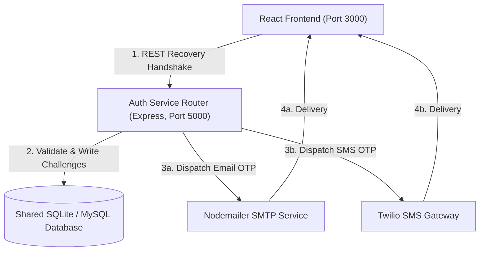
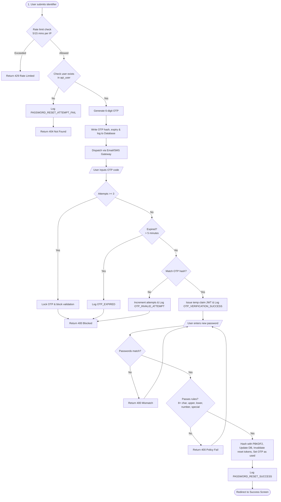

# Secure Password Recovery Feature: Architecture & Implementation

This document provides a comprehensive analysis, system design, and API specification for the **Forgot Password** implementation.

---

## 1. System Architecture & Context

The password recovery system is designed as a secure authentication microservice communicating with the client application and internal notifications (SMTP/Twilio). The Node.js Express server runs alongside the Django application, binding to the shared database for accounts parity.

### 1.1 System Architecture Diagram


---

## 2. Database Design & Entity Relationship

The data model stores credentials, OTP verification states, reset lifecycle tracking, and historical audit logs.

### 2.1 Database Entity-Relationship Diagram (ERD)
```mermaid
erDiagram
    api_user ||--o{ otp_verifications : "initiates"
    api_user ||--o{ password_reset_logs : "creates"
    api_user ||--o{ audit_logs : "records"

    api_user {
        int id PK
        string username UNIQUE
        string email UNIQUE
        string phone UNIQUE
        string password
        string role
        string first_name
        string last_name
        boolean is_active
        boolean is_staff
        boolean is_superuser
    }

    otp_verifications {
        int id PK
        string phone_or_email FK
        string otp_hash
        timestamp expiry_time
        int retry_attempts
        boolean is_used
        timestamp created_at
    }

    password_reset_logs {
        int id PK
        int user_id FK
        string request_ip
        string user_agent
        string status
        timestamp created_at
    }

    audit_logs {
        int id PK
        int user_id FK "nullable"
        string action
        text details
        string ip_address
        timestamp timestamp
    }
```

---

## 3. Communication Sequence Diagram

Below is the step-by-step sequence diagram showing how the frontend, Express.js backend, SMTP email service, Twilio SMS service, and SQLite/MySQL database communicate during a secure reset flow.

```mermaid
sequenceDiagram
    autonumber
    actor User as Telehealth Citizen / Member
    participant FE as React Frontend (Port 3000)
    participant BE as Express Backend (Port 5000)
    participant DB as SQLite/MySQL Database
    participant SMTP as SMTP (Nodemailer)
    participant Twilio as SMS (Twilio Gateway)

    User->>FE: Click "Forgot Password?"
    User->>FE: Input Email / Phone Number
    FE->>BE: POST /api/auth/forgot-password (Identifier)
    
    rect rgb(20, 30, 40)
        Note over BE,DB: Core Validation & OTP Generation
        BE->>DB: Query User Table (email = input OR phone = input)
        DB-->>BE: User Profile Records (Exists)
        BE->>BE: Generate secure 6-digit OTP
        BE->>BE: Hash OTP using bcrypt
        BE->>DB: INSERT into otp_verifications (Hash, Expiry, 0 attempts)
        BE->>DB: INSERT into password_reset_logs (user_id, 'requested')
        BE->>DB: INSERT into audit_logs ('PASSWORD_RESET_REQUESTED')
    end

    alt Recipient is Email
        BE->>SMTP: sendMail(otpCode)
        SMTP-->>User: Delivers verification email
    else Recipient is Phone
        BE->>Twilio: createMessage(otpCode)
        Twilio-->>User: Delivers SMS notification
    end

    BE-->>FE: HTTP 200 (OTP sent successfully)
    FE->>FE: Initialize 5-minute Countdown Timer

    User->>FE: Enter 6-digit OTP code
    FE->>BE: POST /api/auth/verify-otp (Identifier, OTP)
    
    rect rgb(20, 30, 40)
        Note over BE,DB: Challenge Validation & Safety Gates
        BE->>DB: Query latest OTP challenge where phone_or_email = Input
        DB-->>BE: OTP records
        BE->>BE: Validate Expiration (time < 5m) & Retry Threshold (< 3 tries)
        BE->>BE: Compare bcrypt.compare(OTP, hash)
    end

    alt OTP Incorrect
        BE->>DB: UPDATE retry_attempts = attempts + 1
        BE->>DB: INSERT into audit_logs ('OTP_INVALID_ATTEMPT')
        BE-->>FE: HTTP 400 (Incorrect code, X attempts remaining)
    else OTP Correct & Valid
        BE->>DB: UPDATE reset logs status = 'verified'
        BE->>DB: INSERT into audit_logs ('OTP_VERIFICATION_SUCCESS')
        BE->>BE: Sign secure temporary Reset JWT token
        BE-->>FE: HTTP 200 (Success, returns reset_token)
    end

    FE->>FE: Mount Reset Form (Checks validation rules)
    User->>FE: Enter New Password & Confirms
    FE->>BE: POST /api/auth/reset-password (reset_token, password)
    
    rect rgb(20, 30, 40)
        Note over BE,DB: Credentials Update & Sessions Revocation
        BE->>BE: Verify temp JWT signature & purpose
        BE->>BE: Validate password strength checks
        BE->>BE: Hash password using Django-compatible PBKDF2 (SHA256)
        BE->>DB: UPDATE api_user SET password = Hash
        BE->>DB: UPDATE otp_verifications SET is_used = true
        BE->>DB: UPDATE password_reset_logs SET status = 'completed'
        BE->>DB: INSERT into audit_logs ('PASSWORD_RESET_SUCCESS')
    end

    BE-->>FE: HTTP 200 (Password reset complete)
    FE->>FE: Mount Success Confirmation screen
    User->>FE: Click "Proceed to Login"
    FE->>FE: Redirects to Standard Login form
```



---

## 4. State Lifecycle & Control Flowchart

The following flowchart outlines the logic loops for OTP generation, rate limiting, and password reset rules validation:



---

## 5. API Endpoints Specification

### 5.1 POST `/api/auth/forgot-password`
Initiates password recovery. Checks rate limits and account existence before dispatching code.

- **Rate Limits:** Max 5 requests per 15 minutes per IP.
- **Request Headers:** `Content-Type: application/json`
- **Request JSON:**
```json
{
  "email_or_phone": "sarah.jenkins@swasthonirapod.com.bd"
}
```
- **Response JSON (200 OK):**
```json
{
  "message": "A 6-digit verification OTP has been sent. Please verify within 5 minutes.",
  "recipient": "sarah.jenkins@swasthonirapod.com.bd"
}
```
- **Response JSON (404 Not Found):**
```json
{
  "error": "No account found with this email address or phone number."
}
```

### 5.2 POST `/api/auth/verify-otp`
Validates OTP token. Enforces expiration check and locks attempts at 3.

- **Rate Limits:** Max 10 verification tries per 15 minutes per IP.
- **Request Headers:** `Content-Type: application/json`
- **Request JSON:**
```json
{
  "email_or_phone": "sarah.jenkins@swasthonirapod.com.bd",
  "otp": "123456"
}
```
- **Response JSON (200 OK):**
```json
{
  "message": "Code verified successfully. Redirecting to reset password.",
  "reset_token": "eyJhbGciOiJIUzI1NiIsInR5cCI6IkpXVCJ9.eyJlbWFpbF9vcl9waG9uZSI6InNhcmFoLmplbmtpbnNAc3dhc3Rob25pcmFwb2QuY29tLmJkIiwidmVyaWZpZWQiOnRydWUsInB1cnBvc2UiOiJwYXNzd29yZF9yZXNldCIsImlhdCI6MTc4MDgyNDYwMCwiZXhwIjoxNzgwODI1MjAwfQ..."
}
```
- **Response JSON (400 Bad Request - Expired):**
```json
{
  "error": "This verification code has expired (5-minute limit). Please request a new OTP."
}
```
- **Response JSON (400 Bad Request - Incorrect):**
```json
{
  "error": "Incorrect verification code. You have 2 attempts remaining."
}
```

### 5.3 POST `/api/auth/reset-password`
Updates password. Validates complexity guidelines and requires the temporary validation token.

- **Request Headers:** `Content-Type: application/json`
- **Request JSON:**
```json
{
  "reset_token": "eyJhbGciOiJIUzI1NiIsInR5cCI6IkpXVCJ9...",
  "new_password": "NewSecurePassword@2026",
  "confirm_password": "NewSecurePassword@2026"
}
```
- **Response JSON (200 OK):**
```json
{
  "message": "Password successfully reset. You can now login with your new credentials."
}
```
- **Response JSON (400 Bad Request - Strength Fail):**
```json
{
  "error": "Password does not meet safety policies. It must be at least 8 characters long, contain an uppercase letter, a lowercase letter, a digit, and a special character."
}
```

---

## 6. End-to-End Step-by-Step Data Flow

1. **Login Page Handshake:**
   The user navigates to `http://localhost:3000/`. They click **"Forgot Password?"** next to the credentials input fields.
2. **Redirect to Forgot Password Wizard:**
   The application updates state views, showing the **Forgot Password Page**. The user inputs either their registered **Email** or **Mobile Number** and clicks "Request Verification OTP".
3. **Account Check & OTP Generation:**
   The request is routed to the Node backend at `http://localhost:5000/api/auth/forgot-password`. The backend queries the `api_user` table in Django's shared `db.sqlite3` file:
   - If not found, it responds with `404 Not Found`.
   - If found, it creates a secure random 6-digit OTP code, hashes it with bcrypt, and saves it in `otp_verifications` table with a 5-minute expiry limit. It writes a password reset log entry and audit trail event in the DB.
4. **OTP Dispatch:**
   The Node backend sends the OTP:
   - SMTP (Nodemailer) for emails.
   - Twilio SMS gateway for mobile numbers.
   In local testing, the service also writes a large copy-pasteable banner directly to the Node terminal.
5. **OTP Verification:**
   The client enters the code. The frontend sends a POST request to `verify-otp`. The backend checks the latest challenge for the recipient:
   - If expired, returns error.
   - If user makes a mistake, the database increments `retry_attempts`. If it hits 3, the code is locked.
   - If correct, the backend logs the success, marks the reset log as `verified`, and signs a temporary JWT token (`reset_token`) containing the verified recipient's identity, expiring in 10 minutes.
6. **Password Update:**
   The client proceeds to the **Reset Password Page**. As they type, a real-time checklist changes from red to green when guidelines are fulfilled (8+ length, upper/lower letters, digit, symbol).
   The user submits their new credentials. The backend verifies the temporary JWT token, hashes the password using Django-compatible PBKDF2 structure (`pbkdf2_sha256`), updates the user's password directly in the database (`api_user.password`), sets `otp_verifications.is_used = true`, and sets the reset log status to `completed`.
7. **Success Action & Login Again:**
   The UI shows the **Success Screen** with a confirmation message. The user clicks "Proceed to Login". They are redirected back to the standard login screen where they can input their username and their *new* password. The Django server on port 8000 successfully verifies the PBKDF2 hash, issues a new platform session token, and grants access to their dashboard!

---

## 7. Security Best Practices Implemented

1. **Brute Force Defense (Failed OTP Lockout):** OTP challenge validation is locked after 3 failures, preventing attackers from trying codes.
2. **API Endpoint Rate Limiting:** Enforces maximum request thresholds (5 requests/15 mins for OTP generation) to mitigate SMS/Email gateway DDoS billing attacks.
3. **Secure OTP Lifecycle:** OTPs are hashed using bcrypt in the database (so database leak doesn't expose active tokens) and have a strict 5-minute time-to-live.
4. **Temporary Claim Tokens:** The reset password phase is protected by a temporary JWT signature token containing user context. You cannot update the password without providing a signature token issued on successful OTP matching.
5. **Audit Event Log Ledger:** Every recovery attempt, validation failure, validation success, lockout, and password update writes a timestamped record to the database showing IP addresses.
6. **Django Compatibility Hashing:** Password values are hashed with Django's standard PBKDF2 configuration in Node, preventing session desynchronization between Django and Node servers.
